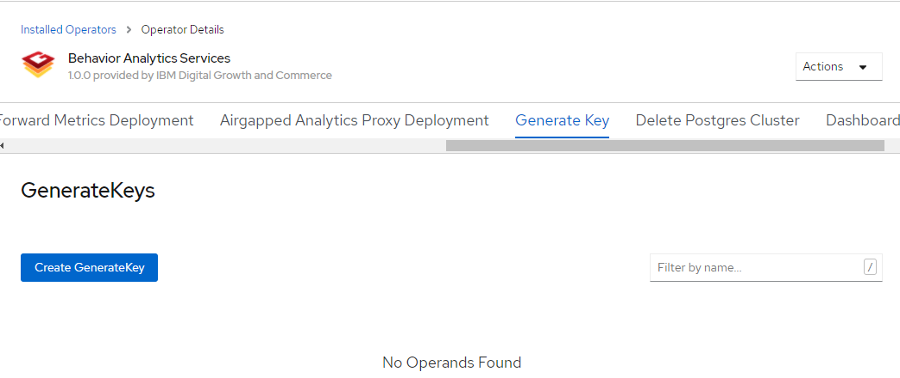
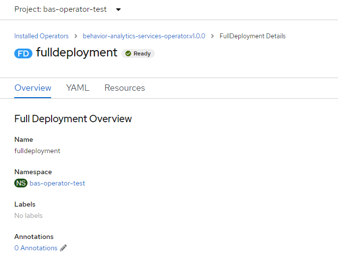
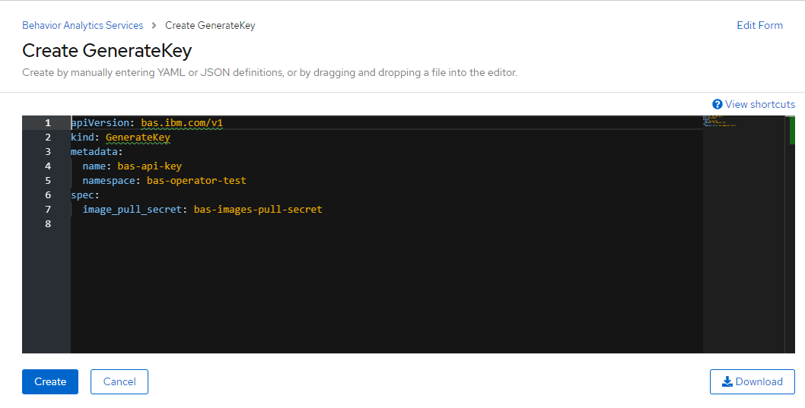

1. Click on the FullDeployment CRD to be installed.

2. Update the deployment yaml as per the specification below-
         Spec                                                 |            Details
    ----------------------------------------------------------|-----------------------------
    ibmproxyurl                                               | URL of IBM Proxy Service
    postgres.storage_class                                    | Storage class of type ReadWriteOnce 
    postgres.size                                             | Size (in Mi or G) of the storage to be attached to the Database
    airgapped.enabled                                         | true/false if airgapped setup is to be enabled. *Requires additional storage
    airgapped.persistent\_storage.storage\_size               | Size (in Mi or G) of the storage to be attached for saving airgapped files
    airgapped.persistent\_storage.storage\_class              | Storage class to be used for the persistent storage
    airgapped.persistent\_storage.backup\_retention\_period   | Number of days to keep the backup files in the storage
    airgapped.persistent\_storage.backup\_deletion\_frequency | Frequency of Cronjob to execute which will delete files from the storage
    event\_scheduler\_frequency                               | Scheduler frequency in Cronjob format to forward events to proxy ( https://en.wikipedia.org/wiki/Cron )
    prometheus\_scheduler\_frequency                          | Prometheus Scheduler Frequency in Cronjob format to pull metrics from Prometheus
    image\_pull\_secret                                       | Secret to pull container images from registry
    segment\_key                                              | Segment key to be used to send events to Segment

3. Click create.

4. The deployment takes ~20 mins to complete. The status of the deployment can be checked on the deployment instance page. The state will be "Ready" when the installation is complete

5. Generate an API Key to use it for authentication (of Onboarding and Metrics APIs)

6. Change the metadata.name in the yaml. Click create.

7. To get the URLs to the Behavior Analytics Services Endpoint URL and  Grafana dashboard URL,
goto Networking->Routes
Search for "bas-endpoint" to get the Behavior Analytics Services Endpoint URL
Search for "grafana-route" to get the Grafana Dashboard URL
  

