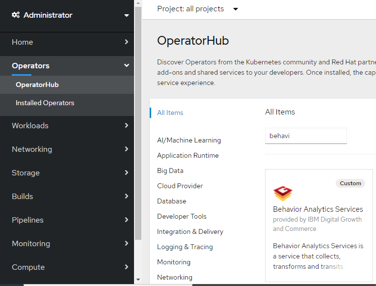
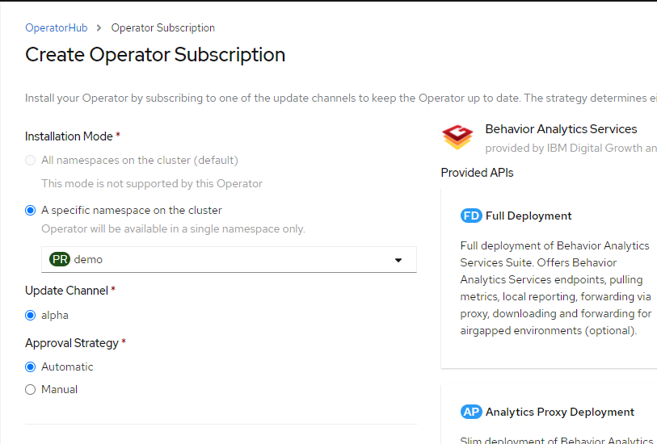

The BAS Operator comes with a easy to use Dashboard that hides the complexity of Openshift resources.
No separate steps are needed to install the Dashboard. It is installed along with the Operator.

1.	In Operator Hub search for the Behavior Analytics Services Operator

2.	Click on the Operator ->Install

3.	Select the namespace where you want the operator to be installed. 
    Choose Automatic Approval Strategy
    Subscribe

4. Once the Operator and Dashboard is installed, the Dashboard instance will be in the "Ready" state.