1. Once the Operator is installed, goto the Dashboard Custom Resource 

2. The Dashboard instance is installed by default with the operator. Click on the Dashboard instance.
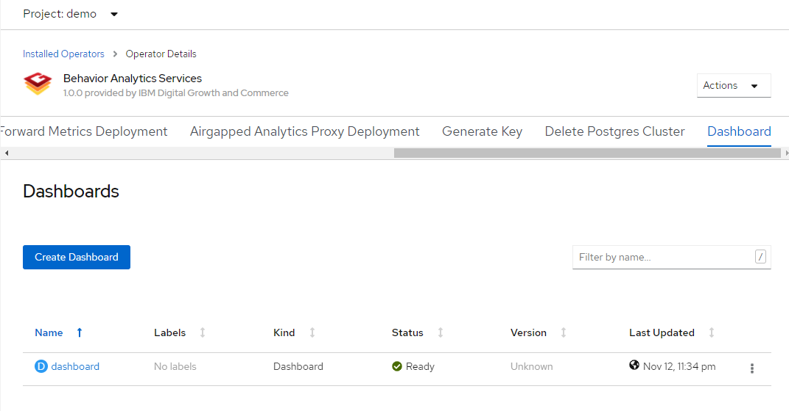

3. The "Behavior Analytics Services Dashboard URL" field has the URL to the Dashboard. Click on the URL
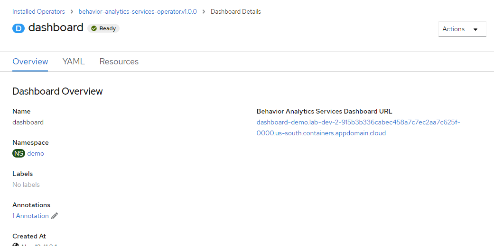

Note- The Dashboard takes ~60 seconds to be up.

4. Login with Openshift Credentials. If prompted for extra permissions, select "Allow selected permissions"

5. Select the Deployment options. Click Create Instance
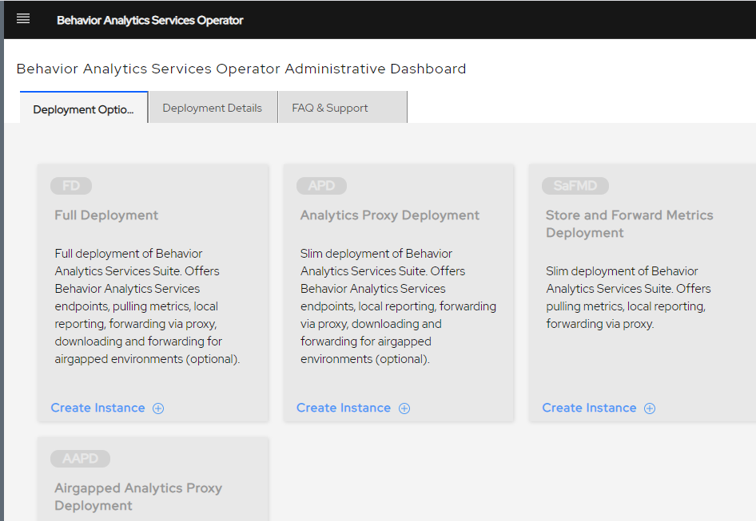

6. Input the credentials to be set while installing PostGreSQL and Grafana. The same credetials are to be used to login to Grafana UI. Click Save and continue
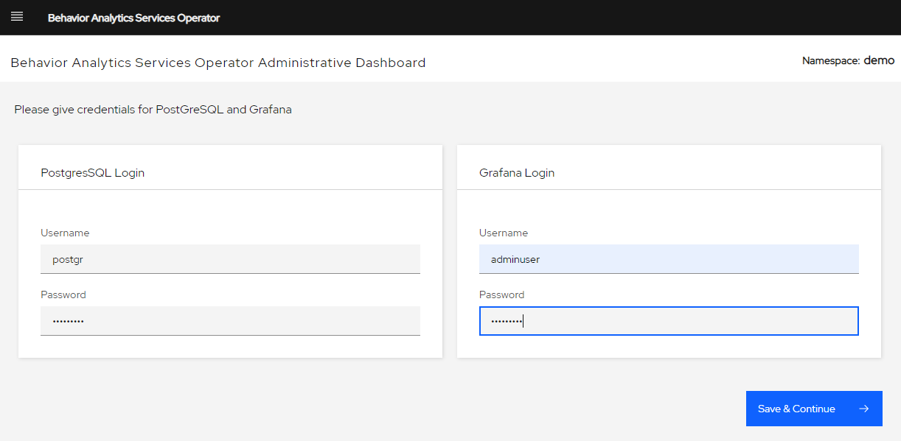

7. Update the deployment yaml as per the specification below-
         Spec                                                 |            Details
    ----------------------------------------------------------|-----------------------------
    ibmproxyurl                                               | URL of IBM Proxy Service
    postgres.storage_class                                    | Storage class of type ReadWriteOnce 
    postgres.size                                             | Size (in Mi or G) of the storage to be attached to the Database
    airgapped.enabled                                         | true/false if airgapped setup is to be enabled. *Requires additional storage
    airgapped.persistent\_storage.storage\_size               | Size (in Mi or G) of the storage to be attached for saving airgapped files
    airgapped.persistent\_storage.storage\_class              | Storage class to be used for the persistent storage
    airgapped.persistent\_storage.backup\_retention\_period   | Number of days to keep the backup files in the storage
    airgapped.persistent\_storage.backup\_deletion\_frequency | Frequency of Cronjob to execute which will delete files from the storage
    event\_scheduler\_frequency                               | Scheduler frequency in Cronjob format to forward events to proxy ( https://en.wikipedia.org/wiki/Cron )
    prometheus\_scheduler\_frequency                          | Prometheus Scheduler Frequency in Cronjob format to pull metrics from Prometheus
    image\_pull\_secret                                       | Secret to pull container images from registry
    segment\_key                                              | Segment key to be used to send events to Segment

8. Click create.
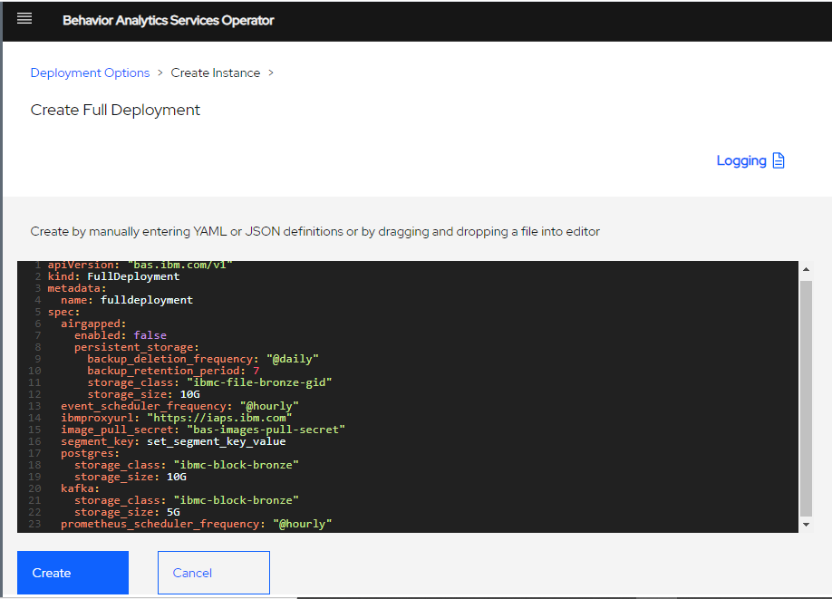

9. The deployment takes ~20 mins to complete. The status of the deployment can be checked on the "Deployment details" tab
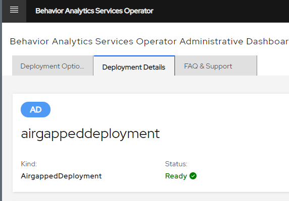

10. Once the deployment is in "Ready" state, the page will show URLs to Behavior Analytics Services Endpoint URL and  Grafana dashboard URL.
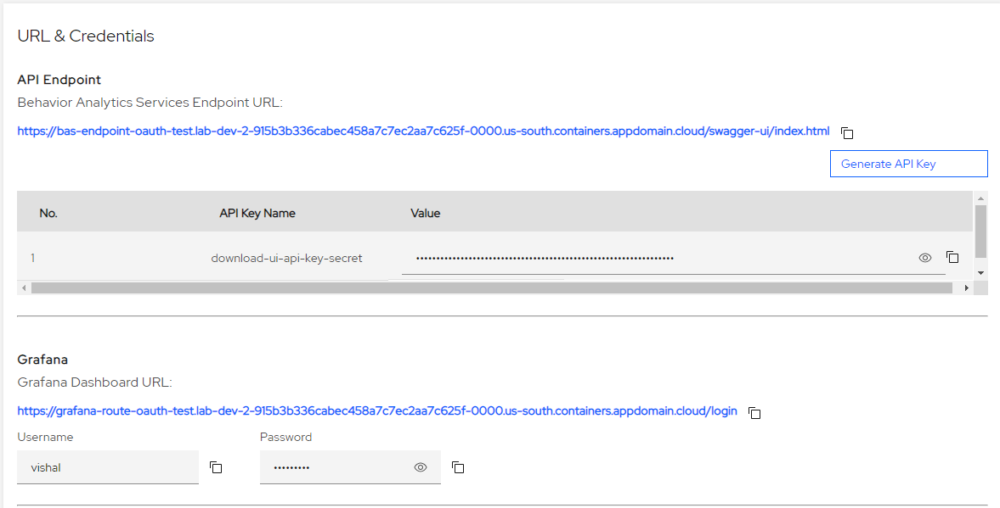

11. Generate an API Key to use it for authentication (of Onboarding and Metrics APIs)
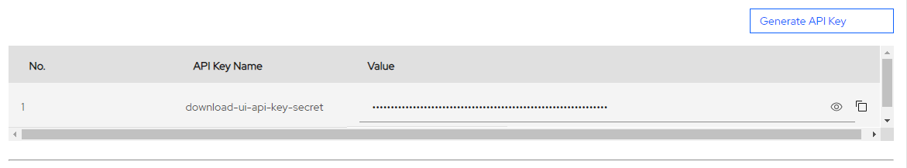

12. Change the metadata.name in the yaml. Click create.
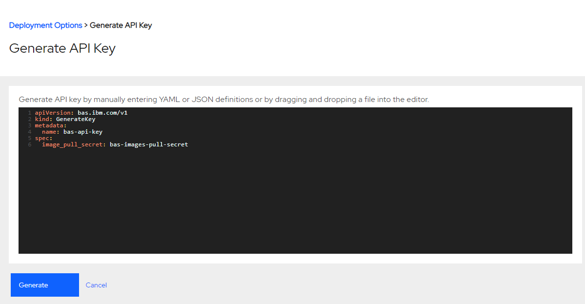

13. [Optional] The BAS Consumption and Analytics APIs can be tested using the Test functionality
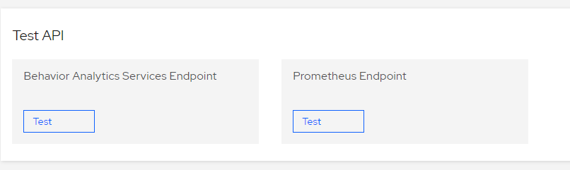

14. Select the Sample API to test. Click Submit. The API response and the Transaction ID will be displayed.
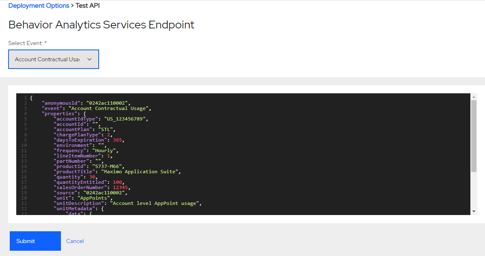   
